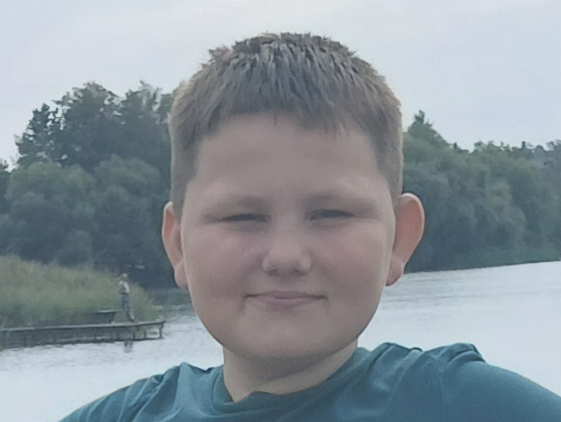

<!-- 🌐 CDN Font Injections for Space Mono -->
<link rel="preconnect" href="https://googleapis.com">
<link rel="preconnect" href="https://gstatic.com" crossorigin>
<link href="https://googleapis.com/css2?family=Space+Mono:ital,wght@0,400;0,700;1,400;1,700&display=swap" rel="stylesheet">

<!-- 🌌 FULL-SCREEN TERMINAL PRELOADER & SEAMLESS TRANSITION -->

  

    <!-- Typing Console Output -->
    

      _
    

    
    <!-- The Jump & Shake Target Quote -->
    

      

        "I use my powers for good (white-hat). Mostly because I look terrible in horizontal stripes and prison coffee is sub-par."
      

    

  

<!-- 📺 Ambient CRT Screen Scanlines -->

<!-- 🌓 Restructured Cyber Theme Controller Bar -->

  <button id="theme-toggle" class="cyber-toggle-btn" aria-label="Toggle system interface matrix">
    [ SYS_MODE: LIGHT ]
  </button>

  

    
    
    <!-- 🟢 Live Status Indicator Dot Badge -->
    
      
      
    
  

  
  <h1 class="glitch-title">Denis Kuizinas</h1>
  
  <!-- Network Availability Caption String -->
  
● OPERATIONAL // AVAILABLE FOR PROJECTS

  
  
Building epic, engaging web applications that connect people across any device.

## 🛠️ System Stack & Core Proficiencies

  JavaScript / TypeScript
  Python
  HTML5 / CSS / SCSS
  React
  Node.js

## 💻 Decrypted Repositories & Works

Select a secure terminal data node block below to view operational source code files.

  <!-- Project Card 1 -->
  <a href="https://wap.cloud.stusite.me/bustimes" target="_blank" rel="noopener" class="project-card">
    

      <h3>Bus Timetable for WAP (dumb) phones</h3>
      
A lightweight Bus Timetable engine accessible anywhere globally, built for minimalist mobile viewports.

    

    

      HTML5
      CSS
    

  </a>

  <!-- Project Card 2 -->
  <a href="https://cloud.stusite.me/source" target="_blank" rel="noopener" class="project-card">
    

      <h3>Source Code Repository Hub</h3>
      
Access the structural base directories and deployment source files for my live web platforms.

    

    

      React
      Node.js
    

  </a>

 

## 📬 Open Secure Channel

Have a development project option or an engineering infrastructure task you want to discuss? Securely message me directly using the transmission form below.

  <form action="https://formspree.io/f/myezzbgn" method="POST" class="portfolio-form">
    

      <label for="name">User Identity</label>
      <input type="text" name="name" id="name" placeholder="Your Name" required>
    

    

      <label for="email">Return Channel (Email)</label>
      <input type="email" name="_replyto" id="email" placeholder="name@example.com" required>
    

    

      <label for="message">Payload Transmission (Message)</label>
      <textarea name="message" id="message" rows="5" placeholder="Write your message here..." required></textarea>
    

    <button type="submit" class="submit-btn">Transmit Payload</button>
  </form>

 

## ☕ Fuel Infrastructure / Support

Really like my coding works? Support my open-source tools today by deploying a donation platform link:

  <!-- GitHub Sponsors Button -->
  <a href="https://github.com/sponsors/d08689390-byte" target="_blank" rel="noopener" class="sponsor-btn-link gh-sponsors">
    <svg class="icon-svg" viewBox="0 0 16 16" version="1.1" width="20" height="20" aria-hidden="true"><path fill="currentColor" d="M4.25 2.5c-1.336 0-2.75 1.164-2.75 3 0 2.15 1.58 4.144 3.365 5.682A20.565 20.565 0 008 13.393a20.561 20.561 0 003.135-2.211C12.92 9.644 14.5 7.65 14.5 5.5c0-1.836-1.414-3-2.75-3-1.373 0-2.331.924-3.25 1.982C7.581 3.424 6.623 2.5 5.25 2.5h-1zM1 5.5c0-2.308 1.83-4 4.25-4 1.77 0 2.93 1.054 3.75 2.03.82-.976 1.98-2.03 3.75-2.03C15.17 1.5 17 3.192 17 5.5c0 2.85-2.08 5.214-4.004 6.879A22.046 22.046 0 018 14.735a22.035 22.035 0 01-4.996-2.356C1.08 10.714-1 8.35-1 5.5z"></path></svg>
    GitHub Sponsors
  </a>

  <!-- Buy Me A Coffee Button -->
  <a href="https://buymeacoffee.com/deniskuizinasdev" target="_blank" rel="noopener" class="sponsor-btn-link bmac">
    <svg class="icon-svg" viewBox="0 0 24 24" width="20" height="20" fill="currentColor"><path d="M20.216 17.141c-.481-.141-.715-.557-.715-1.045v-6.918c0-.472.234-.875.715-1.016 1.778-.52 3.784.814 3.784 2.76v3.421c0 1.959-1.987 3.313-3.784 2.798zm-2.144 1.341c0 2.127-1.749 3.518-3.922 3.518H4.258C1.91 22 0 20.089 0 17.741V5.706C0 3.359 1.91 1.448 4.258 1.448h12.036c2.173 0 3.922 1.391 3.922 3.518v10.597c0 1.109-.899 2.008-2.008 2.008h-.136zm-3.14-13.11c0-.495-.401-.896-.896-.896H5.438c-.495 0-.896.401-.896.896v8.423c0 2.222 1.802 4.024 4.024 4.024h1.792c2.222 0 4.024-1.802 4.024-4.024V5.372z"/></svg>
    Buy Me A Coffee
  </a>

  <!-- Thanks.dev Button -->
  <a href="https://thanks.dev/gh/d08689390-byte" target="_blank" rel="noopener" class="sponsor-btn-link thanks-dev">
    <svg class="icon-svg" viewBox="0 0 24 24" width="20" height="20" fill="currentColor"><path d="M12 21.35l-1.45-1.32C5.4 15.36 2 12.28 2 8.5 2 5.42 4.42 3 7.5 3c1.74 0 3.41.81 4.5 2.09C13.09 3.81 14.76 3 16.5 3 19.58 3 22 5.42 22 8.5c0 3.78-3.4 6.86-8.55 11.54L12 21.35z"/></svg>
    Thanks.dev
  </a>

 
 

